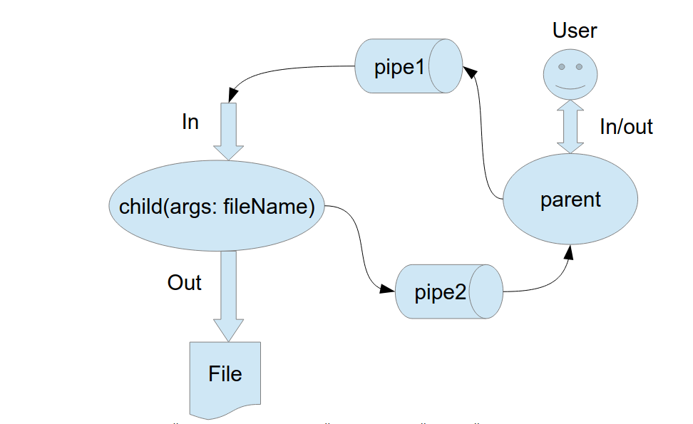

# Operating systems
# Лабораторная работа №1

## Цель работы:
Приобретение практических навыков в 
- Управление процессами в ОС
- Обеспечение обмена данных между процессами посредством каналов

## Задание:
Составить и отладить программу на языке Си, осуществляющую работу с процессами и
взаимодействие между ними в одной из двух операционных систем. В результате работы
программа (основной процесс) должен создать для решение задачи один или несколько
дочерних процессов. Взаимодействие между процессами осуществляется через системные
сигналы/события и/или каналы (pipe).
Необходимо обрабатывать системные ошибки, которые могут возникнуть в результате работы.

## Вариант: 


## Личное задание:
`5 вариант` Пользователь вводит команды вида: «число<endline>». Далее это число передается от
родительского процесса в дочерний. Дочерний процесс производит проверку на простоту. Если
число составное, то это число записывается в файл. Если число отрицательное или простое, то
тогда дочерний и родительский процессы завершаются

## Запуск проекта:

```
make
./client filename 
```
`filename` - имя файла в текущей директории, куда будут сохраняться логи